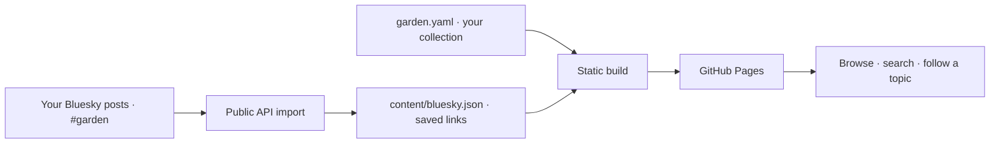

# Digital garden ✳

A quiet index of things worth returning to. Keep talks, papers, essays, books, films, and anything else in one YAML file. Publish on GitHub Pages. Optionally collect links by posting to Bluesky.

**[Visit the garden](https://crs48.github.io/digitalgarden/) · [Edit the collection](./garden.yaml)**

## Make it yours

1. Click **Use this template → Create a new repository**. Choose a public repository.
2. Edit [`garden.yaml`](./garden.yaml): change your name, introduction, personal links, and Bluesky handle. Replace the example entries. Remove `example: true` from any example you decide to keep; the starter notice disappears when none remain.
3. For a fresh collection, set `entries: []` and reset [`content/bluesky.json`](./content/bluesky.json) to `[]`. Set `bluesky.enabled: false` if you don't want imports.
4. In **Settings → Pages → Build and deployment**, choose **GitHub Actions**.
5. Push to `main`, or run **Actions → Publish garden → Run workflow**. The workflow's deployment link is your site.

Works at `username.github.io/repository/`, at the root of a `username.github.io` repository, or on a custom domain. Assets use relative paths, so there is no base-path setting to get wrong. For a custom domain, configure it in GitHub Pages settings and follow [GitHub's domain instructions](https://docs.github.com/en/pages/configuring-a-custom-domain-for-your-github-pages-site).

## Add a link

Append to `entries` in `garden.yaml`, either locally or with GitHub's file editor:

```yaml
- title: A talk I keep coming back to
  url: https://example.com/talk
  creator: Someone thoughtful
  category: Talks
  year: 2024
  note: A few words about what stayed with me.
  tags: [body, movement, attention]
  added: 2026-09-25
  thumbnail: images/talk.jpg
```

Only `title` and `url` are required. A missing category becomes **Links**. A missing date sorts after dated entries in **Newest additions**. YAML order is the default collection order.

| Field | What it does |
| --- | --- |
| `creator` | Author, speaker, director, or source |
| `category` | Any format you like; new categories appear automatically |
| `note` | Your reason for keeping the link; plain text, including multiline YAML |
| `tags` | Any number of topics; multiple selected topics use **AND** |
| `thumbnail` | A remote image URL, or a file placed under `public/images/` |
| `year` | When the work was published |
| `added` | When you added it, using `YYYY-MM-DD` |
| `source` | Optional original Bluesky post or other provenance link |

The `categories` list sets the sidebar order and can include formats with no entries yet. Tag names are freeform; hyphens display as spaces. Search checks titles, authors, notes, categories, URLs, and tags. Filters are reflected in the URL, so a filtered collection can be bookmarked or shared. Press `/` to focus search and Escape to clear it.

The YAML schema offers autocomplete in compatible editors. The build rejects misspelled keys, invalid dates, duplicate links, missing local images, and unsafe URLs with a readable error.

## Collect from Bluesky

The default setting imports **your own original posts marked `#garden`**. For example, publish a post like:

```text
A lovely way to think about collaborative software.
https://www.inkandswitch.com/essay/local-first/
#garden #paper #programming #distributed-data
```

The link preview supplies the title and thumbnail, your post supplies the note, `#paper` sets the category, and the other hashtags become topics. If a link has no preview, its hostname becomes the title; add a YAML entry with the same URL to give it a better title. Reposts and replies are skipped. An embedded link and rich-text links are supported, including multiple links per post.

```yaml
bluesky:
  enabled: true
  handle: your-name.bsky.social
  mode: hashtag       # hashtag | all-links | manual
  hashtag: garden     # without the #
  defaultCategory: Links
  categoryTags:
    paper: Papers
    video: Videos
    book: Books
    movie: Movies
    tv: TV shows
  excludeUrls: []
```

- **`hashtag`** imports only marked posts; **`all-links`** imports every original post containing a link.
- **`manual`** disables automatic importing. Run `npm run sync -- --force` to import marked posts locally, then commit the archive.
- **`enabled: false`** disables both importing and the display of saved imports.
- The GitHub workflow checks every six hours, on each push to `main`, and on manual runs. Scheduled runs can be delayed by GitHub, and [GitHub disables schedules after 60 days of repository inactivity](https://docs.github.com/en/actions/using-workflows/disabling-and-enabling-a-workflow). Re-enable the workflow if needed.
- The importer uses the public Bluesky API. No app password, token, or browser login is needed. It never posts to your account.
- Imports are saved in `content/bluesky.json` and committed by the workflow. They remain available if Bluesky is offline or a post disappears. **Deleting a Bluesky post does not remove an archived garden entry.** Put its URL in `excludeUrls` to remove it and prevent reimporting.
- A YAML entry with the same URL takes precedence over an import. Tracking parameters are ignored when deduplicating; meaningful query parameters and URL fragments are preserved.
- A failed import preserves the saved collection; publishing continues with that collection and an Actions warning. The importer paginates through up to 5,000 posts, then fails visibly rather than silently truncating a larger history.
- Saving imports requires the workflow's `contents: write` permission. If branch protection blocks the bot's direct commits, run imports locally or adapt the workflow to your repository's review policy.



## Develop

Use Node.js 22 or newer (the workflow uses Node.js 24).

```sh
npm ci
npm run dev       # http://localhost:4321; rebuilds when files change, refresh to see edits
npm run sync      # collect eligible public Bluesky posts
npm run check     # run tests and build
npm run build     # output in dist/
```

If the default port is busy, use `PORT=4318 npm run dev`. The preview also serves `/digitalgarden/` to check project-site paths.

There is one production dependency: the YAML parser. The output is static HTML, CSS, and a small script for filtering. Links and notes work without JavaScript. No accounts, database, analytics, or client-side Bluesky requests. Google Fonts provides DM Sans and Instrument Serif, with system-font fallbacks; remote thumbnails are loaded from their source hosts. Self-host these assets if you prefer no third-party requests.

| File | Purpose |
| --- | --- |
| `garden.yaml` | Content, site identity, and import settings |
| `garden.schema.json` | Editor hints and schema |
| `content/bluesky.json` | Durable imported collection |
| `src/styles.css` | Typography, colors, and responsive layout |
| `src/garden.js` | Search, filter, and sort behavior |
| `scripts/` | Validation, rendering, development, and import code |
| `.github/workflows/pages.yml` | Import, build, and publish |

Implementation references: [GitHub Pages custom workflows](https://docs.github.com/en/pages/getting-started-with-github-pages/using-custom-workflows-with-github-pages), [Bluesky API](https://docs.bsky.app/), and [rich-text facets](https://docs.bsky.app/docs/advanced-guides/post-richtext).

## License

MIT. Linked works, third-party thumbnails, and their copyrights belong to their respective creators.
