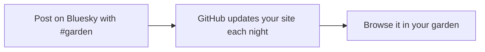

# Digital garden

Turn your Bluesky posts into a personal collection of links, videos, images, and ideas. **Add `#garden` to a post, and it appears in your garden after the next update.** Other hashtags become clickable topic filters.

Your name, avatar, banner, and bio come from Bluesky too. **The only setting you provide is your Bluesky handle.**

**[See an example garden](https://crs.garden/) · [Create your garden](#create-your-garden)**



## Create your garden

You'll need a **Bluesky account** and a **GitHub account**. Everything below happens in your browser: no coding, downloads, API keys, or Bluesky password required.

### 1. Make your own copy

Click **[Use this template](https://github.com/crs48/digitalgarden/generate)**. Choose your GitHub account as the owner, name the repository **`digitalgarden`** (or any name you like), select **Public**, and click **Create repository from template**.

Do the remaining steps in **your new repository**.

### 2. Set your Bluesky handle

Open **Settings → Secrets and variables → Actions → Variables → New repository variable**. Fill in these two fields, then click **Add variable**:

| Field | What to enter |
| --- | --- |
| **Name** | `BLUESKY_HANDLE` |
| **Value** | Your handle, such as `your-name.bsky.social` or `@crs.land` |

Use your own handle, not your display name or a profile URL. The `@` is optional. Choose the **Variables** tab, not **Secrets**.

### 3. Turn on GitHub Pages

Open **Settings → Pages**. Under **Build and deployment**, set **Source** to **GitHub Actions**.

### 4. Publish your garden

Open **Actions → Publish garden → Run workflow**, leave the branch as **main**, then click **Run workflow** in the menu.

Wait for the run to show a green check, then open **Settings → Pages → Visit site**. If you named your repository `digitalgarden`, its address will usually be:

```text
https://YOUR-GITHUB-USERNAME.github.io/digitalgarden/
```

**You're ready.** Add that address to your Bluesky bio and post something with `#garden`. Your garden updates automatically every night. Existing posts with `#garden` are collected too; if you haven't posted any yet, you'll see an empty garden.

## Post on Bluesky → see it in your garden

Post these examples from the Bluesky account you configured, replacing the text and links with your own favorites. Each post becomes **one card** after the next successful update.

### Save a paper or essay

```text
Out of the Tar Pit

A paper I keep returning to about accidental complexity.
https://curtclifton.net/papers/MoseleyMarks06a.pdf
#garden #paper #code
```

**In your garden:** a card titled **Out of the Tar Pit**, with your commentary and a link to the PDF. It appears under **Papers** and the **#paper** and **#code** topic filters.

### Keep a favorite video

```text
Simple Made Easy

A favorite talk by Rich Hickey.
https://www.youtube.com/watch?v=SxdOUGdseq4
#garden #code
```

**In your garden:** a **Simple Made Easy** card with an embedded YouTube player, under **Videos** and **#code**. It plays when a visitor chooses to watch it.

### Collect a photo or a thought

Attach a photo in Bluesky and post:

```text
A little room to breathe

A reminder to slow down.
#garden #body #movement
```

**In your garden:** the photo and your words appear together under **Images**, **#body**, and **#movement**. The photo's alt text comes along too. Post the same text without a photo and it appears under **Notes** instead.

### A few simple rules

- **`#garden` adds the post.** Posts without it stay out of the garden. It does not appear as a topic filter itself.
- **Other hashtags organize it.** Choose any topics you like. Click a topic to filter; click it again to turn it off. Selecting several topics shows posts that match all of them.
- **Your first line becomes the title.** A short heading followed by a blank line, as in the examples above, works well. Your remaining text becomes the commentary.
- **One post stays together.** Multiple images or links remain in one card. Every card links back to its original Bluesky post, and @mentions link to accounts.

The garden recognizes links, notes, images, videos, and audio automatically. You can choose a format explicitly with a hashtag:

| Hashtag | Format |
| --- | --- |
| `#paper`, `#essay`, `#book` | Papers, Essays, Books |
| `#talk`, `#video`, `#movie`, `#tv` | Talks, Videos, Movies, TV shows |
| `#image`, `#audio`, `#note` | Images, Audio, Notes |

YouTube and Vimeo links get video players. Spotify, SoundCloud, and direct audio links get audio players. Bluesky images and videos are supported, including GIFs that loop silently after you press play.

## When does it update?

Your garden refreshes **nightly at 3:23 a.m. Pacific**. It is not an instant feed: new posts appear after the next successful build.

**Want a post to appear sooner?** In your repository, open **Actions → Publish garden → Run workflow**. This refreshes both your posts and your profile. GitHub schedules can sometimes run late; the [workflow scheduling docs](https://docs.github.com/en/actions/reference/workflows-and-actions/events-that-trigger-workflows#schedule) explain the timing.

To change your name, avatar, banner, or bio, edit your Bluesky profile. To remove an entry, delete its Bluesky post; the next successful update removes it from the garden.

<details>
<summary><strong>Need help getting started?</strong></summary>

| What you see | What to do |
| --- | --- |
| The first run failed before you finished setup | Complete steps 2 and 3, then run **Publish garden** again. |
| A handle error | Check that `BLUESKY_HANDLE` is under **Actions → Variables**, spelled exactly, and contains your handle rather than a URL. |
| A Pages configuration error | Set **Settings → Pages → Source** to **GitHub Actions**, then rerun the workflow. |
| The garden is empty | Post from the configured account with `#garden`, then run **Publish garden**. |
| A new post hasn't appeared | Wait for the nightly update or run it manually. Check the latest run for errors. |
| Workflows are disabled in a fork | Enable them in **Actions**, then follow steps 2–4. Variables must be set separately in each copy. |

For GitHub's illustrated instructions, see [copying a template](https://docs.github.com/en/repositories/creating-and-managing-repositories/creating-a-repository-from-a-template), [adding repository variables](https://docs.github.com/en/actions/how-tos/write-workflows/choose-what-workflows-do/use-variables), and [setting the Pages publishing source](https://docs.github.com/en/pages/getting-started-with-github-pages/configuring-a-publishing-source-for-your-github-pages-site).

You can use your own domain later; it isn't needed to get started. Follow GitHub's [custom domain guide](https://docs.github.com/en/pages/configuring-a-custom-domain-for-your-github-pages-site).

</details>

<details>
<summary><strong>More about syncing and browsing</strong></summary>

The garden opens in masonry view. The buttons beside the filters switch between masonry and a full feed; shared URLs preserve your filters and chosen view. Search covers titles, commentary, links, formats, and tags. Click the search icon or press `/` to open it; Escape clears and closes it. Format and sort menus support arrow keys, typing an option's name, and Enter to select.

Posts are pulled in GitHub Actions, just before the build. Every run fetches your public profile and posts, keeps the posts tagged `#garden`, saves a snapshot, builds the static site, and deploys it to GitHub Pages. Visitors read the built site; their browsers do not fetch your Bluesky feed.

The scheduled run is **nightly at 3:23 a.m. Pacific** (`America/Los_Angeles`, including daylight saving time). Pushing to `main` or choosing **Actions → Publish garden → Run workflow** runs the same pipeline immediately, so you can publish a new post without waiting for the next night. GitHub schedules can run later than their scheduled time. See [GitHub's scheduling documentation](https://docs.github.com/en/actions/reference/workflows-and-actions/events-that-trigger-workflows#schedule).

- Only your own posts containing `#garden` are imported. Marked replies and quote posts are included; reposts and unmarked posts are not.
- The marker is case-insensitive. A URL fragment such as `https://example.com/#garden` does not count as a hashtag.
- **Bluesky is the source of truth.** After a successful complete sync, deleted posts and posts no longer marked `#garden` disappear. Removing a tag requires changing/replacing the source post through whatever editing features your Bluesky client supports.
- Two different posts about the same link remain distinct. Repeated imports of the same post do not create duplicates.
- Your public name, bio, avatar, and banner refresh along with your posts. Missing profile images have a simple fallback.
- GitHub [disables scheduled workflows after 60 days of repository inactivity](https://docs.github.com/en/actions/using-workflows/disabling-and-enabling-a-workflow). Re-enable **Publish garden** in the Actions tab if needed.
- The importer reads the public Bluesky API without logging in and never posts to your account.
- `content/garden.json` is a generated snapshot, **not an authoring file**. A failed or incomplete import leaves the entire previous snapshot untouched. Publishing may use that snapshot only when it belongs to the configured handle. This means a deleted post may remain visible during an API outage until a successful sync.
- Feed pagination is limited to 5,000 posts. A larger history fails visibly and keeps the previous snapshot instead of silently truncating it.
- The workflow commits changed snapshots with `contents: write`. If branch protection blocks bot commits, run sync locally or adapt the workflow to your repository's review process.

Changing accounts is as simple as updating `BLUESKY_HANDLE` and running the workflow again. The next successful sync replaces the entire saved profile and collection.

</details>

<details>
<summary><strong>Develop locally</strong></summary>

Use Node.js 22 or newer; GitHub Actions uses Node.js 24.

```sh
npm ci
BLUESKY_HANDLE=your-name.bsky.social npm run sync
npm run dev       # http://localhost:4321
npm run check     # tests and static build
npm run build     # output in dist/
```

After the first sync, local `npm run sync` can reuse the handle in the saved snapshot. `BLUESKY_HANDLE` overrides it. A build uses the saved snapshot without making network requests; when a handle is explicitly set, the saved identity must match it.

If port 4321 is busy, use `PORT=4318 npm run dev`. Refresh the browser after source changes; the server rebuilds automatically. The preview also supports `/digitalgarden/` for checking GitHub project-page asset paths.

The output is static HTML, CSS, and small scripts for filtering and media playback. Posts remain readable without JavaScript. System fonts avoid an external font request. Remote profile images, media, and embedded players load from their source hosts. YouTube uses its privacy-enhanced domain. A self-hosted HLS.js player loads only when a visitor plays a streaming video.

| File | Purpose |
| --- | --- |
| `content/garden.json` | Generated public profile and current garden posts |
| `scripts/bluesky.mjs` | Post extraction, hashtag rules, and pagination |
| `scripts/sync-bluesky.mjs` | Atomic snapshot refresh |
| `scripts/data.mjs` | Content and identity validation |
| `scripts/render.mjs` | Profile, feed, and media rendering |
| `src/styles.css` | Bluesky-inspired appearance and responsive layout |
| `src/garden.js` | Search, format, topic, sort, and view controls |
| `src/dropdown.js` | Accessible format and sort menus |
| `src/masonry.js` | Responsive card placement and media resizing |
| `.github/workflows/pages.yml` | Import, build, and publish |

Built with the [public Bluesky API](https://docs.bsky.app/) and [GitHub Pages](https://docs.github.com/en/pages/getting-started-with-github-pages/using-custom-workflows-with-github-pages). This is an independent project, not an official Bluesky feature.

</details>

## License

MIT. Linked works, profile images, and media belong to their respective creators.
