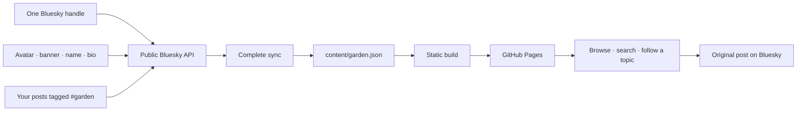

# Digital garden

Your Bluesky profile, with a little more room for the things you love. Post with **#garden** to collect links, ideas, images, videos, and audio in a garden of your own. Every other hashtag becomes a topic you can browse.

**[Visit the garden](https://crs.garden/) · [Public repository](https://github.com/crs48/digitalgarden)**

Your avatar, banner, display name, bio, and posts all come from Bluesky. There is no YAML collection, manual content editor, account to create, or app password to manage. The site is static and hosted on GitHub Pages.

## Make it yours

1. **[Use this template](https://github.com/crs48/digitalgarden/generate)** to create a public repository.
2. In your new repository, open **Settings → Secrets and variables → Actions → Variables**. Add a repository variable named **`BLUESKY_HANDLE`** with your handle, such as `your-name.bsky.social`. This is a public handle, not a secret or password.
3. In **Settings → Pages → Build and deployment**, choose **GitHub Actions**.
4. Run **Actions → Publish garden → Run workflow**. Your profile and `#garden` posts replace the template's saved snapshot automatically. The deployment link opens your garden.
5. Add that garden URL to your Bluesky bio so people can move between your profile and your collection.

That's the setup. From then on, tend your garden by posting on Bluesky.

To use a different name in your garden, optionally add a **`GARDEN_DISPLAY_NAME`** repository variable. It overrides the displayed name while posts and other profile details continue to sync from Bluesky. For local previews, use `GARDEN_DISPLAY_NAME="Your name" npm run dev`. Leave it unset to use your Bluesky display name.

The workflow checks your handle before publishing. It will not publish this template's saved profile as your own if setup is missing or importing a different account fails. A profile with no `#garden` posts gets a real empty garden.

The site works at `username.github.io/repository/`, at the root of a `username.github.io` repository, and on [custom domains](https://docs.github.com/en/pages/configuring-a-custom-domain-for-your-github-pages-site). Asset paths are relative.

## Plant something

Write a post on Bluesky:

```text
A lovely way to think about collaborative software.
https://www.inkandswitch.com/essay/local-first/
#garden #paper #programming #distributed-data
```

Every post with **#garden** becomes one entry. Text-only posts work too. Other hashtags become topic filters, including format tags like `#paper`. Formats appear only when the garden contains posts in them.

| What you post | What appears in your garden |
| --- | --- |
| A thought | A readable note |
| A link | A link preview, with your own commentary |
| YouTube or Vimeo | An embedded video player |
| Bluesky images | An image or gallery with the original alt text |
| Bluesky video or GIF | A video player; GIFs loop silently after play |
| Direct image or audio link | An image or audio player |
| Spotify or SoundCloud | An audio embed |
| Several links or attachments | One post with all of its media |

Use `#talk`, `#video`, `#paper`, `#essay`, `#book`, `#movie`, `#tv`, `#image`, `#audio`, or `#note` to choose a format. Without a format tag, the garden recognizes Videos, Images, Audio, Notes, or Links from the content. Any other hashtag still works as a topic.

The title comes from your first line or sentence. To choose a title, write a short first line followed by a blank line:

```text
Attention is a practice

A small reminder to notice what is already here.
#garden #attention #body
```

Long titles are shortened while preserving the full text below. Title extraction does not require an AI service or API key. Players never autoplay, and every entry links back to its original Bluesky post for the conversation.

Search covers titles, notes, links, formats, and hashtags. Multiple selected topics use **AND**. Search and filters are reflected in the URL so you can share a particular corner of your garden. Press `/` to search and Escape to clear the search box.

## How syncing works

- Only your own posts containing `#garden` are imported. Marked replies and quote posts are included; reposts and unmarked posts are not.
- The marker is case-insensitive. A URL fragment such as `https://example.com/#garden` does not count as a hashtag.
- **Bluesky is the source of truth.** After a successful complete sync, deleted posts and posts no longer marked `#garden` disappear. Removing a tag requires changing/replacing the source post through whatever editing features your Bluesky client supports.
- Two different posts about the same link remain distinct. Repeated imports of the same post do not create duplicates.
- Your public name, bio, avatar, and banner refresh along with your posts. Missing profile images have a simple fallback.
- The workflow runs every six hours, on pushes to `main`, and on manual runs. GitHub can delay schedules and [disables them after 60 days of repository inactivity](https://docs.github.com/en/actions/using-workflows/disabling-and-enabling-a-workflow).
- The importer reads the public Bluesky API without logging in and never posts to your account.
- `content/garden.json` is a generated snapshot, **not an authoring file**. A failed or incomplete import leaves the entire previous snapshot untouched. Publishing may use that snapshot only when it belongs to the configured handle. This means a deleted post may remain visible during an API outage until a successful sync.
- Feed pagination is limited to 5,000 posts. A larger history fails visibly and keeps the previous snapshot instead of silently truncating it.
- The workflow commits changed snapshots with `contents: write`. If branch protection blocks bot commits, run sync locally or adapt the workflow to your repository's review process.



Changing accounts is as simple as updating `BLUESKY_HANDLE` and running the workflow again. The next successful sync replaces the entire saved profile and collection.

## Develop

Use Node.js 22 or newer; GitHub Actions uses Node.js 24.

```sh
npm ci
BLUESKY_HANDLE=your-name.bsky.social npm run sync
npm run dev       # http://localhost:4321
npm run check     # tests and static build
npm run build     # output in dist/
```

After the first sync, local `npm run sync` can reuse the handle in the saved snapshot. `BLUESKY_HANDLE` overrides it. A build uses the saved snapshot without making network requests; when a handle is explicitly set, the saved identity must match it.

If port 4321 is busy, use `PORT=4318 npm run dev`. Refresh the browser after source changes; the server rebuilds automatically. The preview also supports `/digitalgarden/` for checking GitHub project-page asset paths.

The output is static HTML, CSS, and small scripts for filtering and media playback. Posts remain readable without JavaScript. System fonts avoid an external font request. Remote profile images, media, and embedded players load from their source hosts. YouTube uses its privacy-enhanced domain. A self-hosted HLS.js player loads only when a visitor plays a streaming video.

| File | Purpose |
| --- | --- |
| `content/garden.json` | Generated public profile and current garden posts |
| `scripts/bluesky.mjs` | Post extraction, hashtag rules, and pagination |
| `scripts/sync-bluesky.mjs` | Atomic snapshot refresh |
| `scripts/data.mjs` | Content and identity validation |
| `scripts/render.mjs` | Profile, feed, and media rendering |
| `src/styles.css` | Bluesky-inspired appearance and responsive layout |
| `src/garden.js` | Search, format, topic, and sort controls |
| `.github/workflows/pages.yml` | Import, build, and publish |

Built with the [public Bluesky API](https://docs.bsky.app/) and [GitHub Pages](https://docs.github.com/en/pages/getting-started-with-github-pages/using-custom-workflows-with-github-pages). This is an independent project, not an official Bluesky feature.

## License

MIT. Linked works, profile images, and media belong to their respective creators.
